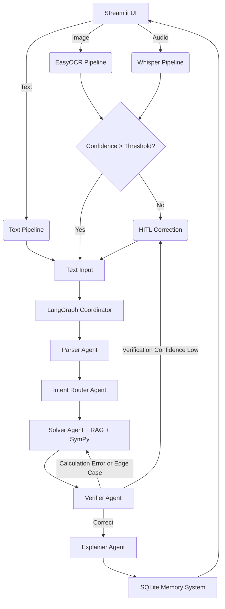

# Reliable Multimodal Math Mentor AI

A production-ready AI application capable of solving JEE-style math problems using RAG, Multi-Agent Reasoning (LangGraph), Human-in-the-loop (HITL), and long-term memory.

## Architecture Diagram



## Setup Instructions

1. **Clone the repo**
2. **Setup virtual environment**:
   ```bash
   python -m venv venv
   source venv/bin/activate  # On Windows: venv\Scripts\activate
   ```
3. **Install Dependencies**:
   ```bash
   pip install -r requirements.txt
   ```
4. **Environment Variables**:
   Copy `.env.example` to `.env` and fill in your keys.
5. **Run the App**:
   ```bash
   streamlit run ui/app.py
   ```

## Deployment Steps
- **Streamlit Cloud**: Connect your GitHub repository to Streamlit Cloud, specify `ui/app.py` as the main entry point, and copy the `.env` contents to Streamlit secrets.
- **HuggingFace Spaces**: Create a Streamlit space, copy the repository, add the secrets in the Space settings. Add a `packages.txt` if system dependencies are needed (e.g., ffmpeg for Whisper).

## Overview
- **Agents**: Uses LangGraph to orchestrate Parser, Router, Solver, Verifier, and Explainer agents.
- **RAG Pipeline**: Retrieves geometric, algebraic, or calculus formulas from FAISS / Sentence-Transformers.
- **Memory**: Stores human feedback, input images, and previous results.
- **HITL (Human in the Loop)**: Any OCR failure, audio transcription ambiguity, or low verification confidence prompts human interaction in the Streamlit UI.
