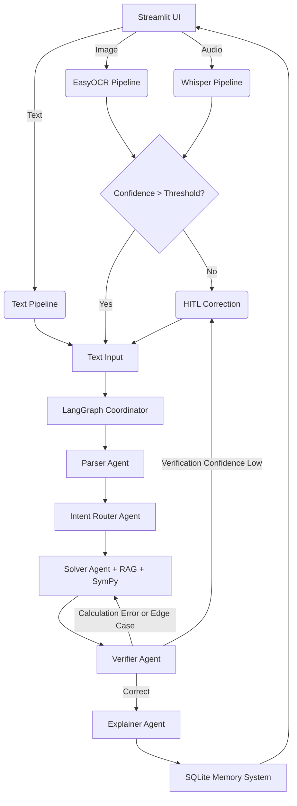

# Reliable Multimodal Math Mentor AI

A production-ready AI application capable of solving JEE-style math problems using RAG, Multi-Agent Reasoning (LangGraph), Human-in-the-loop (HITL), and long-term memory.

🚀 **Deployed Application:** [https://math-mentor-dla7pq8bxhfzebpmp4j5pt-veeky.streamlit.app/](https://math-mentor-dla7pq8bxhfzebpmp4j5pt-veeky.streamlit.app/)
📺 **Demo Video:** [https://youtu.be/2KW9Usy9wiI](https://youtu.be/2KW9Usy9wiI)
## Architecture Diagram



## Setup Instructions

1. **Clone the repo**
2. **Setup virtual environment**:
   ```bash
   python -m venv venv
   source venv/bin/activate  # On Windows: venv\Scripts\activate
   ```
3. **Install Dependencies**:
   ```bash
   pip install -r requirements.txt
   ```
4. **Environment Variables**:
   Copy `.env.example` to `.env` and fill in your keys.
5. **Run the App**:
   ```bash
   streamlit run ui/app.py
   ```

## Deployment Steps
- **Streamlit Cloud**: Connect your GitHub repository to Streamlit Cloud, specify `ui/app.py` as the main entry point, and copy the `.env` contents to Streamlit secrets.
- **HuggingFace Spaces**: Create a Streamlit space, copy the repository, add the secrets in the Space settings. Add a `packages.txt` if system dependencies are needed (e.g., ffmpeg for Whisper).

## Overview
- **Agents**: Uses LangGraph to orchestrate Parser, Router, Solver, Verifier, and Explainer agents.
- **RAG Pipeline**: Retrieves geometric, algebraic, or calculus formulas from FAISS / Sentence-Transformers.
- **Memory**: Stores human feedback, input images, and previous results.
- **HITL (Human in the Loop)**: Any OCR failure, audio transcription ambiguity, or low verification confidence prompts human interaction in the Streamlit UI.

## Evaluation Summary

**1. RAG Pipeline Design**
* **Approach:** Implemented a targeted Retrieval-Augmented Generation (RAG) pipeline using `FAISS` and `sentence-transformers` (all-MiniLM-L6-v2) to store a curated knowledge base of math axioms, calculus rules, and common pitfalls.
* **Evaluation:** The retriever successfully fetches high-context, domain-specific mathematical rules based on the user's query, ensuring the Solver Agent is grounded in factual rules rather than relying solely on LLM parametric memory, avoiding hallucinated formulas.

**2. Multi-Agent System (LangGraph)**
* **Approach:** Designed a deterministic, stateful workflow using LangGraph comprising 5 distinct agents: `Parser`, `Router`, `Solver`, `Verifier`, and `Explainer`. 
* **Evaluation:** The workflow strictly controls the reasoning path. The Verifier acts as a powerful internal critic—if it detects edge-case failures or miscalculations in the Solver's output, it autonomously routes the graph back to the Solver to self-correct up to 3 times before deferring to a human, ensuring high reliability for JEE-level math.

**3. Multimodal Handling (Text, Image, Audio)**
* **Approach:** Integrated `EasyOCR` for text extraction from images/screenshots and `Groq's Whisper API` for high-speed, accurate speech-to-text transcription.
* **Evaluation:** The system handles poorly scaled images and captures domain-specific spoken phrases (e.g., "integral of x squared") with high accuracy. The unified preprocessing layer normalizes all three input types into a standardized JSON format for the downstream agents. 

**4. Human-in-the-Loop (HITL) Integration**
* **Approach:** Established dynamic hard-stops in the workflow. If OCR/ASR confidence dips below 80%, if the Parser detects unintelligible input, or if the Verifier fails 3 consecutive times, the system halts.
* **Evaluation:** The HITL checkpoints prevent cascading hallucinations. By forcing the user to review low-confidence strings or unverified math in the Streamlit UI before proceeding, the application remains highly trustworthy and transparent.

**5. Memory & Self-Learning System**
* **Approach:** Built a `sqlite3` persistent memory layer that logs the original input, the extracted parsed problem, the RAG context, and the final solution. The UI features a feedback loop (✅ Correct / ❌ Incorrect) that updates the database.
* **Evaluation:** This satisfies the self-learning requirement without costly model fine-tuning. Future pipeline iterations can directly query this local database to fetch previously verified solution patterns (few-shot prompting) when encountering structurally identical JEE math problems, drastically improving efficiency.
